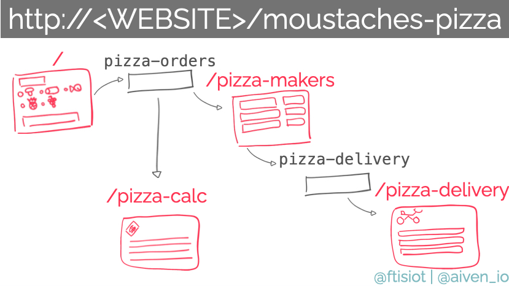

Demo Project for Apache Kafka® and Flask
========================================

This repo contains a demo Flask app using Apache Kafka® as backend. It provides examples of:

* Apache Kafka producer and consumer
* Topic partitions and parallel consumers
* Consumer Group
* Kafka Connect sink to [OpenSearch](https://developer.aiven.io/docs/products/opensearch/index.html)

The default code uses [Aiven for Apache Kafka®](https://developer.aiven.io/docs/products/kafka/index.html) and [Aiven for OpenSearch](https://developer.aiven.io/docs/products/opensearch/index.html), but can work with any Apache Kafka® and OpenSearch environments by changing the `HOST` and `PORT` parameters. If you want to give a try to Aiven for Apache Kafka, you can [sign-up for our trial](https://console.aiven.io/signup?utm_source=github&utm_medium=blog&utm_campaign=flask_kafka).

Overview
========
An overview of the flask app is provided in the above diagram



The Flask app contains the following endpoints:

* `/`: to view the list of pizza options and place an order in the `pizza-orders` topic
* `/pizza-makers`: to view the `pizza-orders` topic data and act as a "pizzaiolo" making a pizza and sending it to delivery (`pizza-delivery` topic). The example supports up to 2 parallel `pizza-makers` sessions, if more than one is open each of the sessions will show up only data coming from a single Kafka topic partition
* `/pizza-ready/<id>`: when a pizza is ready, the pizzaiolo will be able to click the related button in `/pizza-makers` page and the order will be added to the `pizza-delivery` topic by calling this endpoint
* `/pizza-calc`: to view the `pizza-orders` topic data as a billing person. This consumer is associated to a different consumer group compared to `pizza-makers` so both will receive the same order
* `/pizza-delivery`: to view the `pizza-delivery` topic data.

Setup
============

1. Create a virtual environment

   ```
   python3 -m venv kafka-flask
   source kafka-flask/bin/activate
   ```

2. Install the required dependencies

   ```
   pip install -r requirements.txt
   ```

3. Copy the `env.conf.example` to `env.conf` and customize the parameters for `TOKEN` and `PROJECT_NAME`

4. Create [Aiven for Apache Kafka]() (requires [jq](https://stedolan.github.io/jq/) to be installed)

   ```
   code/start-services.sh
   ```

   This code will create:

   * An Aiven for Apache Kafka service named `demo-kafka` in the project passed as parameter
   * A local folder called `certs` containing the required SSL certificate files required for the connection
   * An environment file `code/kafka-endpoint-conf.py` containing the Aiven for Apache Kafka service endpoints
   * An Aiven for Opensearch service named `demo-opensearch` in the project passed as parameter
   * An Kafka Connect configuration file `code/opensearch_sink.json` allowing to sink the `pizza-orders` data into an OpenSearch Index

5. To start the flask app execute

   ```
   python code/app.py
   ```

6. Open the following windows in a browser to check the various endpoints

   * `http://127.0.0.1:5000/`: to view the list of pizza options and place an order in the `pizza-orders` topic
   * `http://127.0.0.1:5000/pizza-makers`: to view the `pizza-orders` topic data and act as a "pizzaiolo" making a pizza and sending it to delivery (`pizza-delivery` topic). The example supports up to 2 parallel `pizza-makers` sessions, if more than one is open each of the sessions will show up only data coming from a single Kafka topic partition
   * `http://127.0.0.1:5000/pizza-calc`: to view the `pizza-orders` topic data as a billing person. This consumer is associated to a different consumer group compared to `pizza-makers` so both will receive the same order
   * `http://127.0.0.1:5000/pizza-delivery`: to view the `pizza-delivery` topic data.

7. Optionally, execute the following code to start the Kafka Connect connector to sink the `pizza-orders` topic data to Opensearch

    ```
    avn service connector create demo-flask-kafka @code/opensearch_sink.json
    ```

8. To delete all services run

   ```
   code/delete-services.sh
   ```


License
============
Apache Kafka® on Flask is licensed under the Apache license, version 2.0. Full license text is available in the [LICENSE](LICENSE) file.

Please note that the project explicitly does not require a CLA (Contributor License Agreement) from its contributors.

Contact
============
Bug reports and patches are very welcome, please post them as GitHub issues and pull requests at https://github.com/ftisiot/flask-apache-kafka-demo. 
To report any possible vulnerabilities or other serious issues please see our [security](SECURITY.md) policy.
